# Dirvana - Reach directory nirvana  
[](https://img.shields.io/github/v/release/NikitaCOEUR/dirvana?sort=semver&display_name=release&style=flat&color=%2300ADD8) [](https://codecov.io/gh/NikitaCOEUR/dirvana)  

> [!WARNING]
> **🧪 Beta Status - We Need Your Feedback!**
>
> Dirvana is currently in beta and actively seeking testers to help validate its functionality across different configurations and use cases. Your feedback will help us:
> - Identify edge cases and limitations
> - Improve compatibility across different shell environments
> - Shape the tool's evolution based on real-world usage
>
> Found a bug? Have a feature request? Please [open an issue](https://github.com/NikitaCOEUR/dirvana/issues) or share your experience!

**Automatically load shell aliases, functions, and environment variables per directory.**

Dirvana is a lightweight CLI tool that manages project-specific shell environments. When you enter a directory, Dirvana automatically loads the configuration defined in `.dirvana.yml`, giving you instant access to project-specific commands, environment variables, and functions.

## 🎯 What is Dirvana?

Dirvana solves a common problem: **managing different shell environments for different projects**. Instead of cluttering your `.bashrc` with project-specific aliases or manually sourcing environment files, Dirvana automatically loads the right configuration when you `cd` into a directory.

**The magic:** When you leave the directory, everything is automatically unloaded. No pollution of your global shell environment!

### How it works

```mermaid
graph TD
    A[👤 User: cd ~/projects/myapp] --> B{🔍 Dirvana Hook}
    B --> C[📄 Read .dirvana.yml]
    C --> D{🔒 Authorized?}
    D -->|No| E[⚠️ Warning: Not authorized]
    D -->|Yes| F[🌳 Merge configs<br/>global → parent → current]
    F --> G[💾 Check cache]
    G -->|Hit| H[⚡ Load from cache]
    G -->|Miss| I[🔨 Generate shell code]
    I --> J[💾 Save to cache]
    H --> K[✅ Environment loaded]
    J --> K
    K --> L[✨ Aliases available<br/>🔧 Functions ready<br/>🌍 Env vars set]

    M[👤 User: cd ..] --> N{🧹 Dirvana Hook}
    N --> O[🗑️ Unload aliases]
    O --> P[🗑️ Unload functions]
    P --> Q[🗑️ Unset env vars]
    Q --> R[✅ Clean environment]

    style A fill:#e1f5ff
    style K fill:#c8e6c9
    style L fill:#c8e6c9
    style M fill:#fff3e0
    style R fill:#c8e6c9
    style E fill:#ffcdd2
```



### Example

**Before Dirvana:**
```bash
$ cd ~/projects/terraform
$ export TF_LOG=debug
$ alias tf="task terraform --"
$ alias plan="task terraform -- plan"
$ alias apply="task terraform -- apply"
# ... and don't forget to unset everything when leaving!
```

**With Dirvana:**
```yaml
# .dirvana.yml
aliases:
  tf:
    command: task terraform -- # a specific wrapper via taskfile exist
    completion: terraform  # Inherits terraform's auto-completion!
  plan: task terraform -- plan
  apply: task terraform -- apply

functions:
  greet: |
    echo "Hello, $1!"

env:
  GIT_REPOSITORY:
    sh: git remote get-url origin | sed 's/.*github.com:\(.*\)\.git/\1/'
  PROJECT_NAME: myproject
  TF_LOG: debug

```

```bash
$ cd ~/projects/terraform
# Everything loads automatically!
$ tf <TAB>          # Auto-completion works! ✨
  apply  console  destroy  init  plan  validate ...

$ plan              # Runs: task terraform -- plan
$ apply             # Runs: task terraform -- apply

$ cd ..
# Everything unloads automatically! 🧹
# Your shell is clean again
```

## ✨ Features

- 🚀 **Fast**: <10ms overhead with intelligent caching
- 🔒 **Secure**: Authorization system prevents untrusted configs + Explicit user consent for dynamic environment variables
- 🌳 **Hierarchical**: Merge configurations from parent directories
- 📝 **Simple**: YAML configuration with JSON Schema validation
- 🐚 **Compatible**: Works with Bash and Zsh
- 🔄 **Auto-completion**: Inherits completion from aliased commands (git, kubectl, etc.)
  - 🛠️ **Completion Registry**: Some commands do not have built-in completion support, but we can define custom completions via [registry](./registry/README.md)
- 🎯 **Conditional Aliases**: Execute commands based on runtime conditions (file existence, env vars, etc.)
- 🎨 **Template Variables**: Go templates with Sprig functions for dynamic paths and string manipulation

## 📦 Installation

### Using go install

```bash
go install github.com/NikitaCOEUR/dirvana/cmd/dirvana@latest
```

### Download Binary

#### Aqua Method
If you use [aqua](https://aquaproj.github.io/), add this to your `aqua.yaml`:

> Dirvana is available starting from v4.223.0

```yaml
registries:
- type: standard
  ref: v4.223.0 # renovate: depName=aquaproj/aqua-registry
packages:
  - name: NikitaCOEUR/dirvana@vX.Y.Z # replace with latest version
```

then run:

```bash
aqua install
```

#### Go Method
Download the latest release for your platform:

**Linux:**
```bash
curl -L https://github.com/NikitaCOEUR/dirvana/releases/latest/download/dirvana-linux-amd64 -o /usr/local/bin/dirvana
chmod +x /usr/local/bin/dirvana
```

**macOS:**
```bash
curl -L https://github.com/NikitaCOEUR/dirvana/releases/latest/download/dirvana-darwin-amd64 -o /usr/local/bin/dirvana
chmod +x /usr/local/bin/dirvana
```

See all releases at [GitHub Releases](https://github.com/NikitaCOEUR/dirvana/releases).

### Setup Shell Hook

Install the shell hook (required for automatic loading):

```bash
dirvana setup
```

This adds a hook to your `~/.bashrc` or `~/.zshrc` that automatically runs when you change directories.

**Reload your shell (or restart your terminal):**
```bash
source ~/.bashrc  # or ~/.zshrc
```

## Quick Start

1. **Initialize a project** (creates `.dirvana.yml` with JSON Schema validation):
```bash
cd your-project
dirvana init or dirvana edit
```

2. **Authorize the project**:
```bash
dirvana allow
```

3. **Reload your configuration**:
```bash
eval "$(dirvana export)" # or cd .. && cd -
```

Your aliases, functions, and environment variables are now loaded!

## Configuration

Dirvana supports two types of configuration files:

1. **Global config**: `~/.config/dirvana/global.yml` - Applied to all projects
2. **Local configs**: `.dirvana.yml` in project directories - Project-specific settings

Configuration files are merged in this order: global → root → parent → current directory (child configs override parent values).

### YAML Example

All configuration files generated by `dirvana init` or `dirvana edit` automatically include JSON Schema validation for IDE support (auto-completion, validation, documentation).

```yaml
# yaml-language-server: $schema=https://raw.githubusercontent.com/NikitaCOEUR/dirvana/main/schema/dirvana.schema.json

# Simple aliases
aliases:
  ll: ls -lah
  gs: git status
  build: go build -o bin/app ./cmd

# Aliases with auto-completion support
# The 'completion' field makes the alias inherit completion from the target command
aliases:
  tf: terraform # Now 'tf <TAB>' works like 'terraform <TAB>'!

  k:
    command: kubecolor
    completion: kubectl    # Kubernetes resource completion! With colors!

  g: git # Git branch/file completion!

# Conditional aliases - execute different commands based on conditions
aliases:
  kubectl:
    when:
      all:
        - var: "KUBECONFIG"  # Check env var is set
        - file: "$KUBECONFIG"  # Check file exists
    command: kubectl --kubeconfig "$KUBECONFIG"
    else: kubectl  # Fallback if conditions not met

  deploy:
    when:
      file: ".env"  # Check if .env exists
    command: ./deploy.sh
    else: "echo 'Error: .env file not found'"

# Functions - reusable command sequences
functions:
  mkcd: |
    mkdir -p "$1" && cd "$1"

  deploy: |
    echo "Deploying to $1..."
    task deploy -- "$1"

# Environment variables
env:
  # Static values
  PROJECT_NAME: myproject
  LOG_LEVEL: debug
  TF_LOG: info

  # Dynamic values from shell commands (like Taskfile)
  GIT_BRANCH:
    sh: git rev-parse --abbrev-ref HEAD

  PROJECT_ROOT:
    sh: pwd

  CURRENT_USER:
    sh: whoami

# Prevent merging with parent configs (only use this directory's config)
local_only: false

# Ignore global config (start fresh from this directory)
ignore_global: false
```

### Dynamic Environment Variables

Dirvana supports dynamic environment variables that are evaluated at load time using shell commands (similar to Taskfile's `sh` syntax):

```yaml
env:
  # Static value
  PROJECT_NAME: myproject

  # Dynamic value - executes shell command
  GIT_BRANCH:
    sh: git rev-parse --abbrev-ref HEAD

  CURRENT_USER:
    sh: whoami

  BUILD_TIME:
    sh: date +%s
```

The shell commands are executed when the configuration is loaded, and the output becomes the environment variable value.

**Security Note:** Dynamic environment variables require explicit user authorization for each project to prevent execution of untrusted code. An authorization prompt appears the first time you enter a new directory with dynamic env vars.

### Conditional Aliases

Dirvana supports conditional aliases that execute different commands based on runtime conditions. This is useful for:
- Checking if required files or directories exist before running commands
- Verifying environment variables are set
- Ensuring required tools are installed
- Providing fallback commands when conditions aren't met

#### Basic Conditions

```yaml
aliases:
  # File condition - check if a file exists
  dev:
    when:
      file: "package.json"
    command: npm run dev
    else: "echo 'Error: package.json not found'"

  # Variable condition - check if env var is set and non-empty
  aws-deploy:
    when:
      var: "AWS_PROFILE"
    command: aws deploy push
    else: "echo 'Error: AWS_PROFILE not set. Run: export AWS_PROFILE=...' && false"

  # Directory condition - check if directory exists
  test:
    when:
      dir: "node_modules"
    command: npm test
    else: "echo 'Run npm install first' && false"

  # Command condition - check if command exists in PATH
  dc:
    when:
      command: "docker"
    command: docker compose
    else: "echo 'Docker not installed'"
```

#### Multiple Conditions with `all` and `any`

Use `all` (AND logic) or `any` (OR logic) to combine multiple conditions:

```yaml
aliases:
  # All conditions must be true (AND)
  k:
    when:
      all:
        - var: "KUBECONFIG"       # Check env var is set
        - file: "$KUBECONFIG"     # Check file exists
    command: kubectl --kubeconfig "$KUBECONFIG"
    else: kubectl  # Use default kubectl

  # At least one condition must be true (OR)
  config-edit:
    when:
      any:
        - file: ".env.local"
        - file: ".env"
        - file: ".env.example"
    command: vim $(ls .env.local .env .env.example 2>/dev/null | head -1)
    else: "echo 'No config file found'"

  # Nested conditions for complex logic
  deploy:
    when:
      all:
        - var: "AWS_PROFILE"
        - command: "aws"
        - any:
            - file: ".env.production"
            - file: ".env"
    command: ./deploy.sh
    else: "echo 'Prerequisites not met: need AWS_PROFILE, aws CLI, and .env file' && false"
```

#### Reusing Conditions with YAML Anchors

For complex projects, you can define conditions once and reuse them with YAML anchors:

```yaml
# Define reusable conditions with anchors
conditions:
  kubeconfig:
    when: &kubeconfig
      all:
        - var: "KUBECONFIG"
        - file: "$KUBECONFIG"

  talosconfig:
    when: &talosconfig
      file: "$TALOSCONFIG"

  docker_running:
    when: &docker_running
      all:
        - command: "docker"
        - command: "docker-compose"

# Reuse conditions across multiple aliases
aliases:
  # Kubernetes tools - all require KUBECONFIG
  k:
    when: *kubeconfig
    command: kubectl
    else: "echo 'KUBECONFIG not configured' && false"
    completion: kubectl

  h:
    when: *kubeconfig
    command: helm
    else: "echo 'Helm requires KUBECONFIG to be set' && false"

  kns:
    when: *kubeconfig
    command: kubens
    else: "echo 'kubens requires KUBECONFIG' && false"

  # Talos tools - require TALOSCONFIG
  t:
    when: *talosconfig
    command: talosctl
    else: "echo 'TALOSCONFIG not found' && false"
    completion: talosctl

  # Docker commands
  dc:
    when: *docker_running
    command: docker compose
    else: "echo 'Docker or docker-compose not available' && false"

# Generate config files dynamically
env:
  KUBECONFIG:
    sh: echo "/tmp/kubeconfig-$(echo -n $(pwd) | sha1sum | awk '{print $1}')"

  TALOSCONFIG:
    sh: echo "/tmp/talosconfig-$(echo -n $(pwd) | sha1sum | awk '{print $1}')"
```

#### Real-World Example: Project-Specific Tooling

```yaml
# Dynamic environment variables for project-specific configs
env:
  PROJECT_KUBECONFIG:
    sh: echo "$HOME/.kube/$(basename $(pwd))-config"

  PROJECT_ENV:
    sh: git rev-parse --abbrev-ref HEAD | sed 's/.*\///'  # Extract env from branch

# Define conditions
conditions:
  kube_ready:
    when: &kube_ready
      all:
        - var: "PROJECT_KUBECONFIG"
        - file: "$PROJECT_KUBECONFIG"
        - command: "kubectl"

  has_taskfile:
    when: &has_taskfile
      file: "Taskfile.yml"

aliases:
  # kubectl with automatic config switching
  k:
    when: *kube_ready
    command: kubectl --kubeconfig "$PROJECT_KUBECONFIG"
    else: "echo 'Generate kubeconfig first: task bootstrap' && false"
    completion: kubectl

  # Use Taskfile if available, otherwise direct command
  build:
    when: *has_taskfile
    command: task build
    else: go build -o bin/app ./cmd/app

  deploy:
    when:
      all:
        - *kube_ready
        - *has_taskfile
        - var: "PROJECT_ENV"
    command: task deploy -- --env=$PROJECT_ENV
    else: "echo 'Missing requirements: kubeconfig, Taskfile, or PROJECT_ENV' && false"
```

#### Error Messages

If conditions fail and no `else` is specified, a descriptive error is shown:

```bash
$ k get pods
Error: condition not met for alias 'k':
All conditions must be met:
  ✓ environment variable 'PROJECT_KUBECONFIG' is set
  ✗ file '/home/user/.kube/myproject-config' does not exist
  ✓ command 'kubectl' exists in PATH
```

**Environment Variable Expansion:** File and directory paths support environment variable expansion using `$VAR` or `${VAR}` syntax.

See `examples/conditional-aliases/` for more examples.

### Template Variables

Dirvana supports Go template variables with [Sprig functions](http://masterminds.github.io/sprig/) for dynamic path references and string manipulation, inspired by [Taskfile](https://taskfile.dev).

#### Available Variables

- **`{{.DIRVANA_DIR}}`** - Directory containing the `.dirvana.yml` file where the variable is defined
- **`{{.USER_WORKING_DIR}}`** - Directory where you invoked the command

These variables work perfectly with hierarchical configs - each `.dirvana.yml` file gets its own `DIRVANA_DIR`:

```yaml
# Parent: /project/.dirvana.yml
env:
  PROJECT_ROOT: "{{.DIRVANA_DIR}}"  # /project

# Child: /project/backend/.dirvana.yml
env:
  BACKEND_ROOT: "{{.DIRVANA_DIR}}"  # /project/backend
  # Inherits PROJECT_ROOT=/project from parent
```

#### Using Sprig Functions

Sprig provides 100+ functions for string manipulation, hashing, and more:

```yaml
env:
  # Path manipulation
  PROJECT_NAME: "{{.DIRVANA_DIR | base}}"              # Extract directory name
  PARENT_DIR: "{{.DIRVANA_DIR | dir}}"                 # Get parent directory

  # String transformation
  PROJECT_UPPER: "{{.DIRVANA_DIR | base | upper}}"     # MYPROJECT
  PROJECT_LOWER: "{{.DIRVANA_DIR | base | lower}}"     # myproject

  # Hash functions for unique IDs
  PROJECT_ID: "{{.DIRVANA_DIR | sha256sum | trunc 8}}" # 8-char hash
  CACHE_KEY: "build-{{.DIRVANA_DIR | sha256sum | trunc 8}}"

  # Build paths
  BUILD_DIR: "{{.DIRVANA_DIR}}/build"
  CONFIG_FILE: "{{.DIRVANA_DIR}}/config.yml"

aliases:
  # Always build from project root
  build: "cd {{.DIRVANA_DIR}} && make build"

  # Multi-line with templates
  info: |
    echo "Project: {{.DIRVANA_DIR | base}}"
    echo "Location: {{.DIRVANA_DIR}}"
    echo "Current dir: {{.USER_WORKING_DIR}}"

  # Use in conditionals
  deploy:
    when:
      file: "{{.DIRVANA_DIR}}/deploy.sh"
    command: "{{.DIRVANA_DIR}}/deploy.sh --id={{.DIRVANA_DIR | sha256sum | trunc 8}}"

functions:
  # Jump to project root from anywhere
  goto: "cd {{.DIRVANA_DIR}}"
```

**Common Use Cases:**
- **Monorepos**: Each service has its own `DIRVANA_DIR` pointing to its directory
- **Build paths**: Reference build directories relative to project root
- **Unique identifiers**: Generate cache keys or Docker tags using hashes
- **Dynamic configs**: Create project-specific configuration paths

See [`examples/templating/`](./examples/templating/) for comprehensive examples and all available Sprig functions.

### Global Configuration

Create a global config at `~/.config/dirvana/global.yml` (or `$XDG_CONFIG_HOME/dirvana/global.yml`) to apply settings across all projects:

```yaml
# Global aliases available everywhere
aliases:
  ll: ls -lah
  g: git
  d: docker

# Global environment variables
env:
  EDITOR: vim
  PAGER: less

# Global functions
functions:
  mkcd: |
    mkdir -p "$1" && cd "$1"
```

Local configurations can:
- Add to or override global settings
- Ignore global config entirely with `ignore_global: true`
- Use `local_only: true` to prevent merging with parent directories (but still merge with global)

See the `examples/` directory for more configuration examples.

### IDE Integration with JSON Schema

For auto-completion and validation in your editor, add the schema reference to your config files:

**YAML:**
```yaml
# yaml-language-server: $schema=https://raw.githubusercontent.com/NikitaCOEUR/dirvana/main/schema/dirvana.schema.json

aliases:
  ll: ls -lah
```

**VS Code settings.json (workspace or user):**
```json
{
  "yaml.schemas": {
    "https://raw.githubusercontent.com/NikitaCOEUR/dirvana/main/schema/dirvana.schema.json": [
      ".dirvana.yml",
      ".dirvana.yaml"
    ]
  }
}
```

**Generate schema locally:**
```bash
dirvana schema -o .vscode/dirvana.schema.json
```

This enables:
- ✨ Auto-completion for configuration keys
- 🔍 Inline documentation for all options
- ⚠️ Real-time validation errors
- 💡 IntelliSense suggestions

## Environment Variables

All command parameters can be set via environment variables with the `DIRVANA_` prefix:

```bash
# Set log level (debug, info, warn, error)
DIRVANA_LOG_LEVEL=debug cd ~/project

# Set shell type for hook/setup commands
DIRVANA_SHELL=zsh dirvana hook

# Set previous directory (used internally by the hook)
DIRVANA_PREV=/old/path dirvana export
```

## Commands

### `dirvana export`
Export shell code for the current folder. This is automatically called by the shell hook.

```bash
eval "$(dirvana export)"
```

Flags:
- `--prev` : Previous directory for context cleanup (also via `DIRVANA_PREV`)
- `--log-level` : Log level - debug, info, warn, error (also via `DIRVANA_LOG_LEVEL`, default: warn)

### `dirvana allow [path]`
Authorize a project for automatic execution. Without path, authorizes current directory.

```bash
dirvana allow
dirvana allow /path/to/project
```

### `dirvana revoke [path]`
Revoke authorization for a project.

```bash
dirvana revoke
dirvana revoke /path/to/project
```

### `dirvana list`
List all authorized projects.

```bash
dirvana list
```

### `dirvana status`
Show current Dirvana configuration status including:
- Authorization status
- Configuration hierarchy (from global to local)
- Active aliases, functions, and environment variables
- Cache status
- Configuration flags

```bash
dirvana status
```

### `dirvana init`
Create a sample configuration file in the current directory.

```bash
dirvana init
```

### `dirvana validate [config-file]`
Validate a Dirvana configuration file using JSON Schema and custom validation rules. If no file is specified, looks for a config file in the current directory.

```bash
dirvana validate
dirvana validate /path/to/.dirvana.yml
```

Validation checks:
- **JSON Schema validation** (draft-07) for structure and types
- YAML/TOML/JSON syntax errors
- Name conflicts between aliases and functions
- Empty values in aliases, functions, and shell commands
- Invalid environment variable configurations
- Validates alias/function/env var naming conventions

### `dirvana edit`
Open or create a Dirvana configuration file in your editor (`$EDITOR` or `$VISUAL`). If no config exists, creates a new `.dirvana.yml` with helpful comments and automatic JSON Schema validation support.

```bash
dirvana edit
```

**Note**: Generated files automatically include the JSON Schema reference for IDE validation and auto-completion.

### `dirvana schema [output-file]`
Display or export the JSON Schema (draft-07) for Dirvana configuration files. Useful for IDE integration and validation.

```bash
dirvana schema                    # Print to stdout
dirvana schema -o schema.json     # Save to file
dirvana schema myschema.json      # Alternative syntax
```

The schema can be used with:
- **VS Code**: Add `"$schema"` field to your `.dirvana.yml`
- **IntelliJ/WebStorm**: Automatic detection via JSON Schema Store
- **vim/neovim**: Use with yaml-language-server

Example configuration with schema:
```yaml
# yaml-language-server: $schema=https://raw.githubusercontent.com/NikitaCOEUR/dirvana/main/schema/dirvana.schema.json
aliases:
  test: echo "test"
```

### `dirvana hook`
Print shell hook code for manual installation. The hook includes a safety check to ensure the `dirvana` command exists before executing, preventing "command not found" errors.

```bash
dirvana hook --shell bash
dirvana hook --shell zsh
```

Flags:
- `--shell` : Shell type - bash, zsh, or auto (also via `DIRVANA_SHELL`, default: auto)

### `dirvana setup`
Automatically install shell hook and completion to the appropriate configuration file. If the hook is already installed but outdated, it will be automatically updated.

```bash
dirvana setup --shell bash        # Installs to ~/.bashrc
dirvana setup --shell zsh         # Installs to ~/.zshrc
```

The setup command uses markers (`# Dirvana shell hook - START/END`) to:
- Detect if the hook is already installed
- Compare the installed version with the current version
- Automatically update the hook if it has changed
- Preserve other content in your shell configuration file
- Automatically install shell completion

Flags:
- `--shell` : Shell type - bash, zsh, or auto (also via `DIRVANA_SHELL`, default: auto)

### `dirvana version`
Show version information.

```bash
dirvana version
```

## Shell Completion

Dirvana supports auto-completion for bash and zsh.

### Installing Completion

**Bash:**
```bash
# One-time use (current shell only)
source <(dirvana completion bash)

# Permanent (add to ~/.bashrc)
dirvana completion bash > ~/.bash_completion.d/dirvana

# Or for system-wide
sudo dirvana completion bash > /etc/bash_completion.d/dirvana
```

**Zsh:**
```bash
# One-time use (current shell only)
source <(dirvana completion zsh)

# Permanent (add to ~/.zshrc)
dirvana completion zsh > "${fpath[1]}/_dirvana"
# Then reload: compinit
```

## Development

### Prerequisites

- Go 1.21 or later
- [Task](https://taskfile.dev/) (managed via aqua.yaml, or install via `go install github.com/go-task/task/v3/cmd/task@latest`)
- Optional: [aqua](https://aquaproj.github.io/) for dependency management

### Building

```bash
task build
```

### Testing

```bash
# Run unit tests
task test

# Run tests with coverage
task test-coverage

# Run tests with verbose output
task test-verbose

# Run integration tests (Docker required)
task test-integration

# Run specific shell integration test
task test-integration-bash
task test-integration-zsh
task test-integration-fish

# Run all tests (unit + integration)
task test-all
```

#### Integration Tests

Integration tests validate that Dirvana works correctly in real shell environments using Docker containers:

- **Bash** - Tests aliases, functions, and environment variables in Bash
- **Zsh** - Tests hooks and features in Zsh

Each test:
1. Builds a Docker image with the specific shell
2. Installs Dirvana and sets up hooks
3. Creates a test configuration
4. Validates that all features work correctly

### Available Tasks

Run `task` or `task --list` to see all available tasks.

### Project Structure

```
dirvana/
├── cmd/
│   └── dirvana/          # CLI entry point
├── internal/
│   ├── auth/             # Authorization system
│   ├── cache/            # Cache management
│   ├── cli/              # CLI commands implementation
│   ├── completion/       # Auto-completion engines (Cobra, Flag, Env, Script)
│   ├── config/           # Configuration loading & validation
│   ├── context/          # Directory context management
│   ├── logger/           # Logging
│   ├── shell/            # Shell code generation
│   └── timing/           # Performance timing
├── pkg/
│   └── version/          # Version information
├── hooks/                # Shell hook scripts
├── schema/               # JSON Schema for config validation
├── examples/             # Example configurations
├── tests/                # Integration and completion tests
└── Taskfile.yml          # Build and test automation
```

## Cache

Cache is stored in `$XDG_CACHE_HOME/dirvana/cache.json` and includes:
- Folder path
- Config file hash
- Generated shell code
- Timestamp
- Dirvana version
- `local_only` flag

Cache is automatically invalidated when:
- Configuration files change
- Dirvana version changes

## Authorization

Authorized projects are stored in `$XDG_DATA_HOME/dirvana/authorized.json`.

Only authorized projects can execute automatically. This prevents malicious code execution from untrusted directories.

## Release Process

This project uses [GoReleaser](https://goreleaser.com/) for automated releases with semantic versioning based on conventional commits.

### Conventional Commits

All commits must follow the [Conventional Commits](https://www.conventionalcommits.org/) specification:

- `feat:` - New features (minor version bump)
- `fix:` - Bug fixes (patch version bump)
- `perf:` - Performance improvements (patch version bump)
- `refactor:` - Code refactoring (patch version bump)
- `docs:` - Documentation changes (no version bump)
- `test:` - Test changes (no version bump)
- `chore:` - Maintenance tasks (no version bump)
- `ci:` - CI/CD changes (no version bump)

**Breaking changes**: Add `BREAKING CHANGE:` in the commit footer or `!` after the type (e.g., `feat!:`) for major version bumps.

### Creating a Release

1. Ensure all commits follow conventional commit format
2. Create and push a new tag:
   ```bash
   git tag -a v1.0.0 -m "Release v1.0.0"
   git push origin v1.0.0
   ```
3. GitHub Actions will automatically:
   - Run tests
   - Build binaries for multiple platforms
   - Create GitHub release with changelog

### Release Artifacts

Each release includes:
- Pre-built binaries for Linux, macOS, Windows (amd64, arm64)
- Checksums and signatures

## Contributing

Contributions are welcome! Please ensure:
- All commits follow [Conventional Commits](https://www.conventionalcommits.org/) format
- All tests pass: `task test`
- Code is formatted: `task fmt`
- Linter passes: `task lint`
- Coverage remains at 90%+

## License

MIT License - See LICENSE file for details

## Author

Nikita C (https://github.com/NikitaCOEUR)
